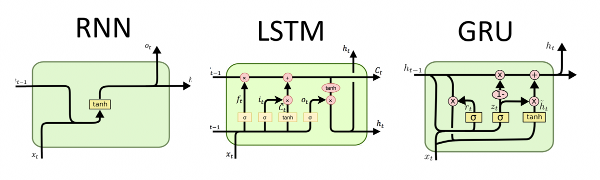

###### Date: 2020.04.20 

# 前情提要
使用 `TensorFlow` 時，可以選擇安裝或不安裝：）

## 本地運行
- 系統環境
  - 64-bit systems
  - Windows 7 or later 
  - macOS 10.12.6 (Sierra) or later (no GPU support)
- 安裝軟體
  - python 3.7
  - [TensorFlow 2](https://www.tensorflow.org/install)：`pip install tensorflow`

## 雲端運行
- [Google Colab / Colaboratory](https://colab.research.google.com/notebooks/welcome.ipynb)
  - Colab 是由 Google 提供以幫助傳播機器學習教育和研究。  
  - Colab 是一個 Jupyter notebook 環境，不需要安裝即可使用，且完全在雲端中運行。

  

# AI 基礎概念
### **機器學習**（Machine Learning）
  - 傳統統計機率 
  - 擅長處理表格（結構化資料）  
  - 資料量需要「千」筆以上，也考慮問題難度，問題若簡單則資料量可不用太多
  - ML 結構：資料 → 特徵擷取 (基於人類知識) → 模型 → 答案
  - 詳見：[https://github.com/yalonw/Machine_Learning](https://github.com/yalonw/Machine_Learning#ml-model-%E5%BB%BA%E7%AB%8B%E6%AD%A5%E9%A9%9F)

### **深度學習**（Deep Learning）
  - 是模仿人類大腦的認知過程，故又稱為**神經網路**
  - 是透過「**組合＋遺忘**」得到結果，而傳統統計無法做到「組合」
  - 擅長處理**圖片、文字、語言**等抽象型資料（非結構化資料）
  - 資料量需要「萬」筆以上，也考慮問題難度，問題困越難資料量需要越多
  - DL 結構：資料 → ~~特徵擷取~~ (由模型自學) → 模型 → 答案

  

# DL 神經網路架構
### **1. Perceptron (單層)感知器**
  - 是一種「**線性**分類器」
  - 只有一個神經元 / unit / score 
  - 分類方法為「All-or-none law 全有全無律」；只有二種選擇 output = 0 or 1
  - 缺點：只用一條線做二分法，無法解決現實問題

--------
  - 問題：二分法（output = 0 or 1）太武斷！
  - 解法：透過 **`sigmoid` 激活函數** 轉換（或稱 Logistic Regression）
  - 成果：使預測結果轉為**機率**（output = 0 ~ 1）的形式，  
    　　　而轉換後並不會改變線性分類的結果  

--------
  - 問題：線性分類不符合現實問題！例如：XOR problem
  - 解法：透過**多個**神經元 / unit / score 組合  
  - 成果：雖然每個神經元組合仍為線性分類，但中間經過 `sigmoid` 轉換，  
    　　　因此最後 output 是帶有非線性的元素

--------
 

### **2. Multilayer Perceptron 多層感知器（MLP）**
  - 是一種「**非線性**分類器」
  - 有多條神經，多個神經元 / unit / score
  - 透過「線性組合＋非線性轉換」，達到「非線性分類」
  - 範例：[MLP_1_MNIST](https://github.com/yalonw/Deep_Learning/blob/master/MLP_1_MNIST.ipynb)、[MLP_2_Fashion_MNIST](https://github.com/yalonw/Deep_Learning/blob/master/MLP_2_Fashion_MNIST.ipynb)

--------
  - 問題：「權重（w）」如何選擇？
  - 解法：「**隨機梯度下降**（stochastic gradient descent）」
    1. 調整方式：隨意選擇權重，再逐步調整，直到誤差最小（min(Loss)），即為最佳預測結果（predict）  
    2. 調整方向：「**負斜率**（negative slope） 或 **梯度下降**（gradient descent）」的方向
       - 二維空間：- dy/dx　　　　　　     --> 負斜率  
       - 三維空間：- ( ∂x/∂z, ∂y/∂z )　　 --> 梯度下降
       - 多維空間：- ( ∂Loss/∂w1, ∂Loss/∂w2, ..., ∂Loss/∂wn )
  - 數學表示式：
    

> **誤差反向傳播**（Backpropagation）：  
  是對神經網絡中所有權重（w）計算損失函數（Loss）的梯度：∂Loss/∂w，  
  並結合隨機梯度下降（stochastic gradient descent）更新權值，以最小化損失函數。

--------
  - 問題：「梯度消失（Vanishing Gradient problem）」  
    　　　 因 `sigmoid` 激活函數的微分介於 0~0.25 之間，經過多層神經網路後，  
    　　　 會使較遠的權值沒有被校正正確，權值會越調整越差，甚至是不調整

  - 解法：將中間層激活函數從 **`sigmoid`** 改為 **`relu`**  
  - 成果：`relu` 被激活後，微分 = 1；因此在誤差反向傳播時，可以正確傳遞  

--------
  - 問題：「激活函數（Activation Function）」如何選擇？
  - **中間層** 激活函數：
      - 必定選擇 `relu`，來將「特徵組合」從線性轉成非線性分類   
      - 而不選擇 `sigmoid` 是因為經過 `sigmoid` 轉換後，  
        誤差（∂Loss/∂w）會隨著傳播越遠越被消弭，而產生「梯度消失問題」
  + **最終層** 激活函數：  
    根據需要的 output 形式來選擇，例如
      - 二元分類：選擇 `sigmoid`，讓機率介於 0 ~ 1 之間
      - 二元分類：選擇 `tanh`　　，讓機率介於 -1 ~ 1 之間
      - 多元分類：選擇 `softmax`，讓機率相加等於 1
      - 回　　歸：不需要激活函數

> 線性分類器與非線性分類器的區別：  
  圖左：非線性分類器  
  圖右：線性分類器，又稱為一刀切
  

--------
 

### **3. Convolutional Neural Network 卷積神經網路（CNN）**
- 在做「影像」辨識時，  
  如果只用 MLP 做出基於**像素 (pixel)** 的分類預測，這樣是不行的！  
  所以有了 CNN ，先對影像做「**特徵萃取**」，再用 MLP 做出基於**特徵**的分類預測～

- **CNN = Convolution + Pooling + Flatten + MLP**
  1. Convolution 卷積：  
     目的：對影像進行**特徵萃取/過濾**，以得到有用的(想要的)資訊  
     方法：改變影像通道數 (channel)   
     注意：(1) 輸入的資料維度必須有「通道數」， shape = ( batch, height, width, **channel** )  
     　　　(2) 圖片越大，才能做越多層卷積 

     

     zero padding：為了不改變影像尺寸，在影像外圍加白邊
     
     

  2. Pooling 池化：  
     目的：減少影像資料量與計算量，並保留重要資訊  
     方法：改變影像高寬 (height, width)  
     例如：MaxPooling、AveragePooling

     

  3. Flatten：將影像轉換成一維陣列 (1D Array)

- CNN 卷積神經網路的架構 = **Convolution + Pooling + Flatten + MLP** 

  
  

- 範例：[CNN_simple_CIFAR10](https://github.com/yalonw/Deep_Learning/blob/master/CNN_simple_CIFAR10.ipynb)

---
- 問題：如何選擇濾鏡 = filter = kernel map？  
  解法：模型會自己解決 XD

- 問題：卷積需要做幾層 layer？每層卷積需要幾個 filter？  
  解法：參考大大的模型 XD  
  例如：**ImageNet** 比賽中，獲獎的演算法～  
  　　　(1) AlexNet：紀念版模型  
  　　　(2) VGG 系列：經典版模型  
  　　　(3) ResNet 系列：特色是使用更多層 layer  
  　　　(4) Inception 系列：特色是使用多種不同大小的 Kernel map (filter)  

  
  > [**ImageNet**](http://www.image-net.org) 是 Hinton 和他的學生建立的大型圖像資料庫。  
    上圖中，縱軸的 Top-1 Accuracy，表示只預測一次且正確的機率。

--------
 

### **4. Transfer Learning 遷移學習（TL）**  
- 簡言之，利用已經訓練好的模型（model）和權重/參數（weight / parameter）做一個新模型。
  - 一般而言，會從頭開始架構自己的模型，並訓練自己的分類器　　（= 好孩子自己寫作業）
  - 偷懶一點，會「參考」別人的模型架構，再訓練自己的分類器　　（= 抄算式但自己作答）
  - 遷移學習，則是「直接使用」別人訓練好的模型和權重，再進行分類　（= 直接複印一份）
  - 注意！以上指的模型架構是指 CNN 那段，MLP 都需要接上自己的分類：
    ~~CNN~~ → MLP → Classifier    

- 範例：[Transfer_dog_cat](https://github.com/yalonw/Deep_Learning/blob/master/Transfer_dog_cat.ipynb)

--------
 

### **5. Word Embedding** 
- **Embedding** 用於 **語意/字詞** 的特徵抓取，是自然語言處理（NLP）的一種技術
- 簡言之，利用降維的方法把「**詞**」轉換成「**詞向量**」，再透過計算「詞向量」之間的「**夾角餘弦值 cosine （cos距離）**」，得出「詞」之間的相似性；也就是在向量空間上比較靠近的詞向量，即可推測為相似詞
- 不僅可以用「詞向量」來表示「詞」，也可以用「字向量」或「句向量」來表示「字」和「句子」

+ 以下是與 Embedding / NLP 相關的套件，可藉此做「語意/字詞」的 Transfer Learning 
  1. **word2vec (W2V) | Google**  
     - 利用上下文意的詞向量，預測下一個詞
     - 例如：目標是「今天午餐”很”好吃耶」，input為「今天、午餐、好吃、耶」，output為「很」  
       　　　透過「cos距離」找到彼此最相似的詞向量，  
       　　　cos0=1 完全相似、cos90=0 不相干、cos180=-1 完全相反     
     - 注意：這裡的「相似」並非指同義詞，而是指詞向量的相似，  
       　　　例如「我OOO你」，只要可以填入 OOO 的詞都稱為相似，  
       　　　好比說「我”喜歡”你」和「我”討厭”你」，此時「喜歡」和「討厭」就為**相似**(的詞量)
     - 缺點：OOV（Out-Of Vocabulary）問題

  2. **Fasttext | Facebook**  
     - 同樣是利用上下文意的詞向量，但設法解決 OOV 問題，透過拆字用「**部分**」去推測答案
     - 例如：中文從「詞向量」改用「字向量」、英文用「字根、字首」
     - 缺點：因為是透過上下文意推測，有順序性，因此必須序列運算，造成低效率

  3. **BERT | Google**  
     - 同樣有上下文的語意推測，但另外有「主題式」的語意推測；並且可以平行運算，解決效率問題

  4. **GPT-2 | OpenAI**  
     - 是一種無監督式的語言**生成式模型（Generative model）**

+ 範例：[Embedding_IMDb_sentiment](https://github.com/yalonw/Deep_Learning/blob/master/Embedding_IMDb_sentiment.ipynb)

--------
 

### **6. Recurrent Neural Network 遞迴神經網路（RNN）**
- RNN 用於有「**時間序列**」的特徵抓取 
- 為了解決 RNN **記憶削減（short-term memory）** 的問題，因此有了改良版：
  - Long Short Term Memory（LSTM）
  - Gate Recurrent Unit（GRU）  
- 詳細圖解說明：[Illustrated Guide to LSTM’s and GRU’s: A step by step explanation](https://towardsdatascience.com/illustrated-guide-to-lstms-and-gru-s-a-step-by-step-explanation-44e9eb85bf21)

  

# 範例程式
> 請按順序學習，每個範例中都有更深入的解釋 :blush:
1. MLP-1：[MNIST](https://github.com/yalonw/Deep_Learning/blob/master/MLP_1_MNIST.ipynb)
2. MLP-2：[Fashion_MNIST](https://github.com/yalonw/Deep_Learning/blob/master/MLP_2_Fashion_MNIST.ipynb)
3. CNN-simple：[CIFAR10](https://github.com/yalonw/Deep_Learning/blob/master/CNN_simple_CIFAR10.ipynb)
4. Transfer Learning：[dog_cat](https://github.com/yalonw/Deep_Learning/blob/master/Transfer_dog_cat.ipynb)
5. Word Embedding：[IMDb_sentiment](https://github.com/yalonw/Deep_Learning/blob/master/Embedding_IMDb_sentiment.ipynb)